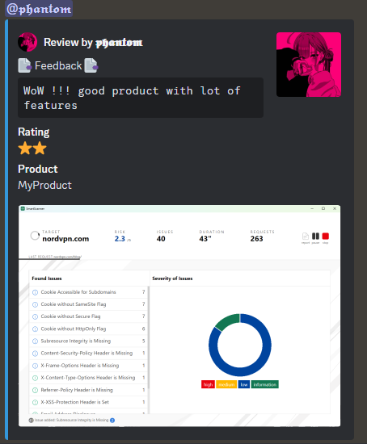
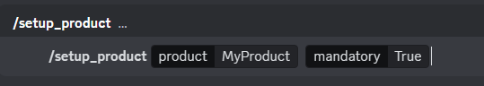
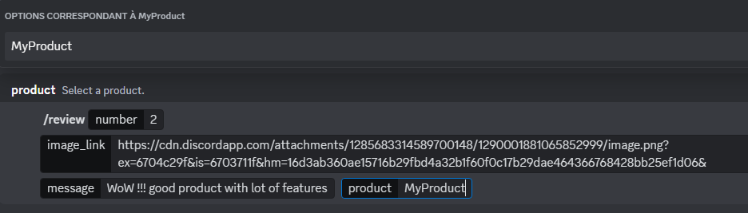

# Discord Review Bot 🚀

A Python Discord bot that allows users to **review products** using **slash commands**. Administrators can set up products using the `/setup_product` command, and users can submit reviews with a star rating using the `/review` command.

## Features ✨

- **Product Setup**: Administrators can add or remove products with the `/setup_product` command.
- **Review Creation**: Users can leave a review for a product with a star rating, a message, and an image link using the `/review` command.
- **Autocomplete**: Autocomplete is integrated for selecting products in the `/review` command and `/setup` command.
- **Permissions**: Only administrators can set up products.




## Installation 📦

1. **Clone the repository**:
    ```bash
    git clone https://github.com/phantom-passwd/discord-review-bot.git
    cd discord-review-bot
    ```

2. **Create a virtual environment and activate it**:
    ```bash
    python -m venv venv
    source venv/bin/activate  # On Windows, use `venv\Scripts\activate`
    ```

3. **Install the required dependencies**:
    ```bash
    pip install -r requirements.txt
    ```

4. **Configure the bot**:
   - Replace the `TOKEN` in the `review.py` file with your **Discord Bot token**.

## Usage 🛠️

1. **Run the bot**:
    ```bash
    python review.py
    ```

2. **Available Commands**:
   - **/setup_product**:
     - Description: Add or remove a product from the list and specify if the product selection is mandatory in the `/review` command.
     - Parameters:
       - `product`: The product to add or remove.
       - `mandatory`: Defines whether product selection is required in the `/review` command.




   - **/review**:
     - Description: Submit a review with a star rating, an image link, and a message.
     - Parameters:
       - `number`: The number of stars (between 1 and 5).
       - `image_link`: A link to an image related to the review.
       - `product`: Select a product from the list (optional).
       - `message`: Your review message.



## License 📄

This project is licensed under License. See the [LICENSE](LICENSE) file for details.

## Contributing 🤝

Contributions are welcome! Please open an issue or submit a pull request for any changes.


😄 BTC >> bc1q25q4dlp98ym8g32uyhf9elazcgv4rltqggzm20

😄 ETH >> 0xAb916211C1ebd0475CC5ae2ad20a46AFe4C7e89F

## Contact 📧

For any inquiries, contact `phantoms_._` on Discord.
